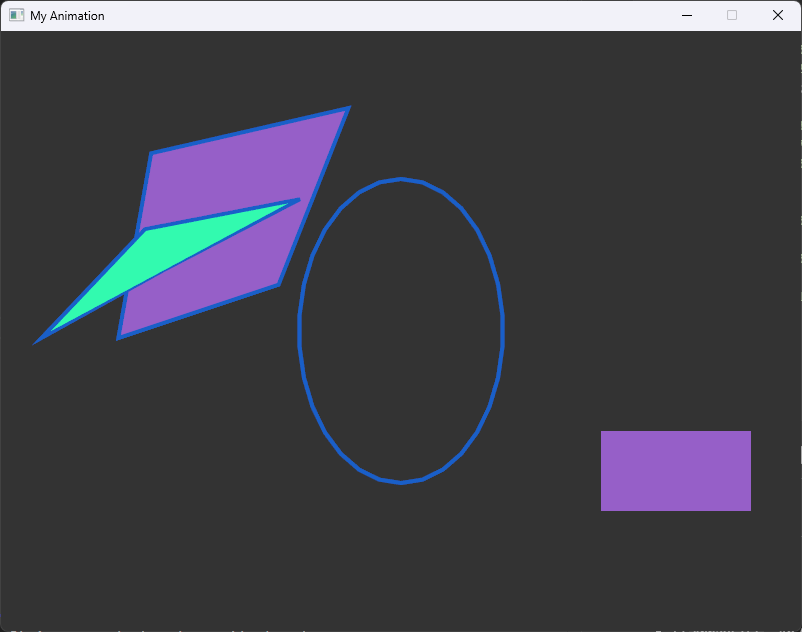

# seal - Super Easy Animation Library
C++ implementation of [Processing](https://processing.org/)

Example
```c++
#include <seal/seal.hpp>

void setup() {
    size(800, 600);
    windowTitle("My Animation");
}

void draw() {
    background(51);

    fill(150, 95, 200);
    stroke(25, 95, 200);
    strokeWeight(4);

    quad(152, 124, 344, 80, 276, 252, 120, 304);
    fill(50, 250, 175);
    triangle(50, 300, 145, 200, 300, 170);
    
    noFill();
    ellipse(400, 300, 100, 150);

    fill(150, 95, 200);
    noStroke();
    rect(600, 400, 150, 80);
}

int main() {
    run();
}
```


# API implmentation status

## Data
### Composite
- [ ] `Array` - An array is a list of data
- [ ] `ArrayList` - An ArrayList stores a variable number of objects
- [ ] `FloatDict` - A simple table class to use a String as a lookup for a float value
- [ ] `FloatList` - Helper class for a list of floats
- [ ] `HashMap` - A HashMap stores a collection of objects, each referenced by a key
- [ ] `IntDict` - A simple class to use a String as a lookup for an int value
- [ ] `IntList` - Helper class for a list of ints
- [ ] `JSONArray` - A JSONArray is an ordered sequence of values
- [ ] `JSONObject` - A JSONObject is an unordered collection of name/value pairs
- [ ] `Object` - Objects are instances of classes
- [ ] `StringDict` - A simple class to use a String as a lookup for an String value
- [ ] `String` - A string is a sequence of characters
- [ ] `StringList` - Helper class for a list of Strings
- [ ] `Table` - Generic class for handling tabular data, typically from a CSV, TSV, or other sort of spreadsheet file
- [ ] `TableRow` - Represents a single row of data values, stored in columns, from a Table
- [ ] `XML` - This is the base class used for the Processing XML library, representing a single node of an XML tree
### Array Functions
### Conversion
### Primitive
###  String Functions

## Input
### Files
### Time & Date
### Keyboard
### Mouse
- [ ] `mousePressed` - Variable storing if a mouse button is pressed
- [ ] `mouseX` - The system variable that always contains the current horizontal coordinate of the mouse
- [ ] `mouseY` - The system variable that always contains the current vertical coordinate of the mouse

## Constants

## Typography

## Rendering

## Image

## Shape
### 2D primitives
- [ ] `arc()` - Draws an arc in the display window
- [x] `circle()` - Draws a circle to the screen
- [x] `ellipse()` - Draws an ellipse (oval) in the display window
- [x] `line()` - Draws a line (a direct path between two points) to the screen
- [x] `point()` - Draws a point, a coordinate in space at the dimension of one pixel
- [x] `quad()` - A quad is a quadrilateral, a four sided polygon
- [x] `rect()` - Draws a rectangle to the screen
- [x] `square()` - Draws a square to the screen
- [x] `triangle()` - A triangle is a plane created by connecting three points
### Attributes
- [x] `ellipseMode()` - Modifies the location from which ellipses are drawn by changing the way in which parameters given to ellipse() and `circle()` are interpreted.
- [x] `strokeWeight()` - Sets the width of the stroke used for lines, points, and the border around shapes

## Output

## Math

## Lights & Camera

## Color
### Setting
- [x] `background()` - Sets the color used for the background of the Processing window
- [x] `clear()` - Clears the pixels within a buffer
- [ ] `colorMode()` - Changes the way Processing interprets color data
- [x] `fill()` - Sets the color used to fill shapes
- [x] `noFill()` - Disables filling geometry
- [x] `noStroke()` - Disables drawing the stroke (outline)
- [x] `stroke()` - Sets the color used to draw lines and borders around shapes

## Transform

## Structure
- [x] `popStyle()` - Saves the current style settings and popStyle() restores the prior settings
- [x] `pushStyle()` - Saves the current style settings and popStyle() restores the prior settings

## Control

## Envioronment
- [x] `size()` - Defines the dimension of the display window in units of pixels
- [x] `windowTitle()` - Defines the title to appear at the top of the sketch window
